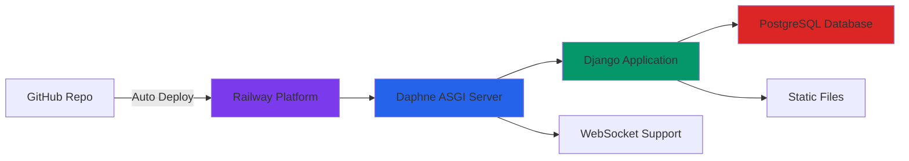

# Railway Deployment Guide - Chess Game

This guide provides step-by-step instructions to deploy your Chess Game application to Railway.

## Prerequisites

✅ GitHub repository: `https://github.com/bishal-2630/Chess.git`  
✅ Railway account: Sign up at [railway.app](https://railway.app)  
✅ Configuration files ready: `railway.toml`, `Procfile`, `requirements.txt`

## Deployment Steps

### Step 1: Create Railway Project

1. Go to [railway.app](https://railway.app) and sign in
2. Click **"New Project"**
3. Select **"Deploy from GitHub repo"**
4. Authorize Railway to access your GitHub account
5. Select the repository: **`bishal-2630/Chess`**

### Step 2: Add PostgreSQL Database

1. In your Railway project dashboard, click **"+ New"**
2. Select **"Database"** → **"Add PostgreSQL"**
3. Railway will automatically:
   - Create a PostgreSQL database
   - Generate a `DATABASE_URL` environment variable
   - Link it to your application

### Step 3: Configure Environment Variables

Click on your service → **"Variables"** tab → Add the following:

#### Required Variables

| Variable | Value | Description |
|----------|-------|-------------|
| `SECRET_KEY` | Generate random key | Django secret key for security |
| `DEBUG` | `False` | Disable debug mode in production |
| `ALLOWED_HOSTS` | `*` | Allow all hosts (already configured in settings) |

**Generate SECRET_KEY:**
```python
# Run this in Python to generate a secure key:
import secrets
print(secrets.token_urlsafe(50))
```

#### Optional - Email Configuration (for OTP)

| Variable | Value | Description |
|----------|-------|-------------|
| `DEFAULT_FROM_EMAIL` | `your-email@gmail.com` | Sender email address |
| `EMAIL_HOST` | `smtp.gmail.com` | SMTP server |
| `EMAIL_HOST_USER` | `your-email@gmail.com` | Email username |
| `EMAIL_HOST_PASSWORD` | `your-app-password` | Email app password |
| `EMAIL_PORT` | `587` | SMTP port |
| `EMAIL_USE_TLS` | `True` | Use TLS encryption |

> [!TIP]
> For Gmail, create an [App Password](https://support.google.com/accounts/answer/185833) instead of using your regular password.

#### Optional - Firebase Configuration

| Variable | Value | Description |
|----------|-------|-------------|
| `FIREBASE_API_KEY` | Your Firebase API key | Firebase authentication |
| `FIREBASE_WEB_API_KEY` | Your Firebase web API key | Firebase web config |

### Step 4: Deploy

1. Railway will automatically detect your Django application
2. It will use the `railway.toml` configuration
3. The deployment process will:
   - Install dependencies from `requirements.txt`
   - Run database migrations
   - Collect static files
   - Start Daphne ASGI server (for WebSocket support)

4. Monitor the deployment logs in the **"Deployments"** tab
5. Wait for the deployment to complete (usually 2-5 minutes)

### Step 5: Get Your Application URL

1. Go to **"Settings"** tab
2. Scroll to **"Domains"** section
3. Click **"Generate Domain"**
4. Your app will be available at: `https://your-app-name.up.railway.app`

## Verification Checklist

After deployment, verify the following:

### ✅ Health Check
Visit: `https://your-app-name.up.railway.app/api/auth/health/`  
**Expected:** JSON response with health status

### ✅ API Documentation
Visit: `https://your-app-name.up.railway.app/swagger/`  
**Expected:** Swagger UI with all API endpoints

### ✅ Flutter Web App
Visit: `https://your-app-name.up.railway.app/`  
**Expected:** Chess game interface loads

### ✅ WebSocket Connection
1. Open browser DevTools (F12)
2. Go to **Console** tab
3. Load the chess game
4. **Expected:** No WebSocket connection errors

### ✅ Guest Login
1. Click "Play as Guest" on the app
2. **Expected:** Immediately enter the game

### ✅ User Authentication (if email configured)
1. Try to register a new account
2. **Expected:** Receive OTP email
3. Verify OTP and login

## Deployment Architecture



## Troubleshooting

### Deployment Fails

**Check Railway Logs:**
1. Go to **"Deployments"** tab
2. Click on the failed deployment
3. Review error messages

**Common Issues:**
- Missing environment variables → Add required variables
- Database connection error → Ensure PostgreSQL is added
- Port binding error → Railway sets `$PORT` automatically

### Application Not Loading

1. **Check deployment status** - Ensure deployment completed successfully
2. **Verify domain** - Make sure domain is generated
3. **Check logs** - Look for runtime errors in Railway logs

### WebSocket Not Working

1. **Verify Daphne is running** - Check logs for "Daphne running"
2. **Check ASGI configuration** - Ensure `chess_backend/asgi.py` is correct
3. **CORS settings** - Verify Railway domain is in `CORS_ALLOWED_ORIGINS`

### Static Files Not Loading

1. **Check collectstatic** - Verify it ran during deployment
2. **WhiteNoise config** - Ensure `whitenoise` is in `MIDDLEWARE`
3. **STATIC_ROOT** - Verify `staticfiles/` directory exists

### Database Errors

1. **Check DATABASE_URL** - Ensure it's set by Railway
2. **Run migrations** - They should run automatically on deploy
3. **Check PostgreSQL** - Verify database service is running

## Environment Variables Reference

### Auto-Generated by Railway
- `DATABASE_URL` - PostgreSQL connection string
- `PORT` - Application port (usually 8000)
- `RAILWAY_STATIC_URL` - Your Railway domain

### Required by You
- `SECRET_KEY` - Django secret key
- `DEBUG` - Set to `False`

### Optional
- Email configuration (for OTP)
- Firebase configuration (for auth)

## Update Deployment

To deploy updates:

1. **Push to GitHub:**
   ```bash
   git add .
   git commit -m "Your update message"
   git push origin main
   ```

2. **Railway auto-deploys** - Changes are automatically deployed
3. **Monitor deployment** - Check Railway dashboard for status

## Rollback Deployment

If something goes wrong:

1. Go to **"Deployments"** tab
2. Find a previous successful deployment
3. Click **"⋮"** (three dots) → **"Redeploy"**

## Cost Estimate

Railway offers:
- **Free Tier:** $5 credit/month (suitable for testing)
- **Hobby Plan:** $5/month for personal projects
- **Pro Plan:** $20/month for production apps

Your Chess Game should run comfortably on the Hobby plan.

## Next Steps

After successful deployment:

1. ✅ Update your Flutter app to use the Railway URL
2. ✅ Test all features thoroughly
3. ✅ Configure custom domain (optional)
4. ✅ Set up monitoring and alerts
5. ✅ Enable automatic backups for PostgreSQL

## Support

- **Railway Docs:** [docs.railway.app](https://docs.railway.app)
- **Railway Discord:** [discord.gg/railway](https://discord.gg/railway)
- **Django Deployment:** [docs.djangoproject.com/en/stable/howto/deployment/](https://docs.djangoproject.com/en/stable/howto/deployment/)

---

**Your Chess Game is ready for Railway! 🚀**
